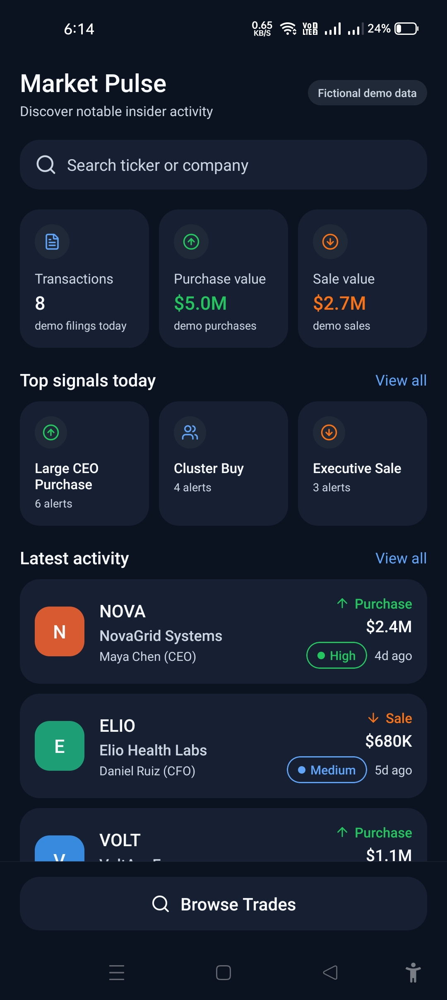
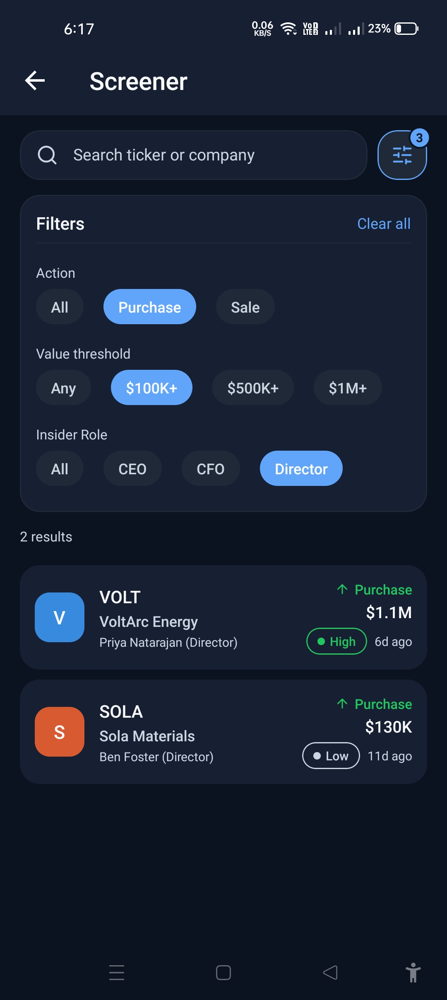
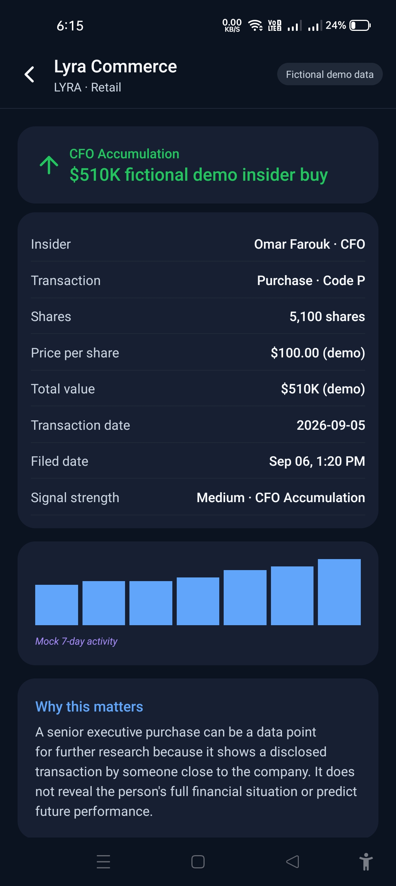

# Market Pulse

## Project Overview
Market Pulse is a mobile prototype designed for scanning fictional disclosed-insider trading activity on mobile devices.

## Concept and Data Statement
This application is an original mobile concept inspired by the broad StockInsider.io product category. StockInsider.io was not used as a data, copy, or UI source for this application. All information and metrics presented throughout the app are local, fictional, mock/demo data created strictly for demonstration.

## Screens and Features
- **Home (`HomeScreen.tsx`)**: Displays aggregate market summary statistics (total transactions, purchase value, and sale value computed from mock filings), high-priority signal chips (such as Large CEO Purchase, Cluster Buy, and Executive Sale), a search shortcut leading to the screener, a preview list of the latest trade cards with tap-through navigation to trade details, and a bottom action button to browse all trades.
- **Screener (`ScreenerScreen.tsx`)**: Provides text search across company names and stock tickers, an expandable filter panel with three independent filter categories (action type: Purchase/Sale; value threshold: $100K+, $500K+, $1M+; insider role: CEO, CFO, Director), a dynamic result count, a scrollable list of filtered trade cards, and an empty-state view with a filter reset option.
- **Trade Details (`TradeDetailsScreen.tsx`)**: Presents a comprehensive breakdown of an individual transaction (insider name, role, transaction code, share count, price per share, total transaction value, transaction date, filing date, and signal strength rating), an SVG-based 7-day mock activity chart, educational context explaining the significance of insider purchases versus sales, and a prototype mock data disclaimer.

## Tech Stack
- **Expo** (`~57.0.22`): Mobile application development platform and build toolchain
- **React Native** (`0.86.3`) / **React** (`19.2.3`): Core mobile framework and component runtime
- **TypeScript** (`~6.0.3`): Static typing and type safety
- **React Navigation** (`@react-navigation/native` `^7.3.18`, `@react-navigation/native-stack` `^7.18.10`): Native stack navigation management
- **lucide-react-native** (`^1.45.0`): Icon library for UI elements
- **react-native-svg** (`15.15.4`): Vector graphics library used for the 7-day activity chart
- **react-native-safe-area-context** (`~5.7.0`) and **react-native-screens** (`~4.26.0`): Safe area management and native screen primitives

## Setup
```bash
git clone https://github.com/fahimx51/market-pulse
cd market-pulse
npm install
npx expo start
```

## Mobile Design Decisions
- **Native Stack Navigation**: Stack navigation via `@react-navigation/native-stack` was chosen over tab navigation to support a focused drill-down workflow (Home to Screener to Trade Details) with standard header back buttons.
- **Local State Management**: React component state (`useState` and `useMemo`) was utilized rather than an external state management library (such as Redux or Zustand) because the application is a self-contained prototype with localized filtering needs.
- **Mobile-Optimized Information Density**: Large tables were replaced with structured cards, touch targets with hit slop extensions, and high-contrast color indicators for transaction types to ensure rapid data scanning on mobile viewports.

## Known Limitations
- Static local data only: all trade items and chart coordinates are stored in local mock files (`data/mockTrades.ts`).
- No live filings: no live integration with real-time stock market data feeds.
- No user authentication: no user accounts, login flows, or cloud synchronization.
- No portfolio tracking or watchlist capabilities.
- No push alerts or automated notification system.
- No backend infrastructure or external database.

## AI-Use Disclosure
I used Claude (chat) throughout development for:
- Deciding to switch from Expo Router's file-based routing to manual React Navigation with a Stack navigator, to match the project's suggested folder structure and drill-down navigation flow
- Generating the fictional mock trade data used in data/mockTrades.ts
- Refactoring parts of my component code for clarity and consistency
- Getting guidance on building and troubleshooting the Android APK via EAS Build, including debugging unexpected build and dependency errors

I reviewed, tested, and can explain all code and design decisions in this project.

## Deliverables
- APK: https://drive.google.com/file/d/1vP3TFaW3ae8zGuzKXzPGUG6FZKyKxYh3/view?usp=sharing
- Demo video: https://drive.google.com/drive/folders/1ihqooSM0YTQD3GJ-nRFjOWdRVjBZtsq3?usp=sharing
- Screenshots: https://drive.google.com/drive/folders/1C7yjtMOomMMsmhF9_7ZEbxZnSmk-hgbj?usp=sharing

## Screenshots
### Home / Market Pulse


### Screener


### Trade Details

